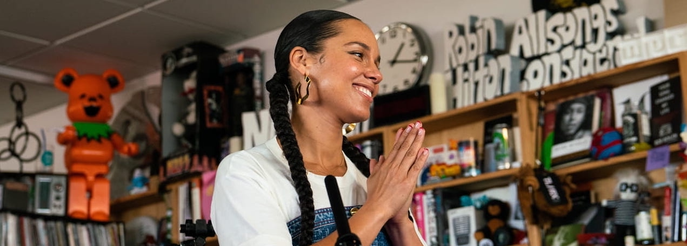

<h1 align="center"> tinyjam </h1>
<h3 align="center"></h3>
<p align="center"> 💃🏽- jam 2 tiny desks </p>


This is a script to download/play tiny desks in the way I like them.

## Installation

### Brew
If you are running MacOS & have `brew` install & run like this
```
brew tap aryakaul/formulae
brew install tinyjam
wget "https://raw.githubusercontent.com/aryakaul/tinyjam/main/arya-curated"
tinyjam -l ./arya-curated -n
```

### PyPI
```
pip install tinyjam
# Ensure `mpv` and `yt-dlp` are installed on your system
wget "https://raw.githubusercontent.com/aryakaul/tinyjam/main/arya-curated"
tinyjam -l ./arya-curated -n
```

### git
Install `mpv` & `yt-dlp`. Then,
```
git clone "https://github.com/aryakaul/tinyjam.git"
cd tinyjam
wget "https://raw.githubusercontent.com/aryakaul/tinyjam/main/arya-curated"
# Optional Python port dependencies
pip install loguru tqdm
# Python edition perks: structured logging, smart search, regex-driven subtitle
# downloads (manual subs only, discovered via `--list-subs`), and mpv auto-loads
# those tracks when the audio language differs.
./tinyjam -l ./arya-curated -n
```

## Usage

```
➜ tinyjam -h

    Jam to tiny desks with tinyjam v0.1.2!
        -l,--list       path to a file where every line is the name of an artist 
                        who appeared on tiny desk. if they did multiple shows
                        adding the year they performed can specify this.
        -o,--output     path to an output directory to download video files to,
                        default is './jamsesh'
        -n,--nodownload do not download video files, instead stream directly 
                        from youtube
        -f,--force      if output directory exists + contains same # of elements as
                        the number of lines in list then nuke contents and
                        download videos again. default behavior is to assume all
                        files are already downloaded and play them
        -j,--jobs       number of parallel downloads to run (0 = auto / all cores)
        -S,--subtitles  preferred subtitle language/regex (manual subs are
                        downloaded only when the Tiny Desk audio is different;
                        default: en)
        -c,--color      flag to display videos in color
        -h,--help       display this help message
```
